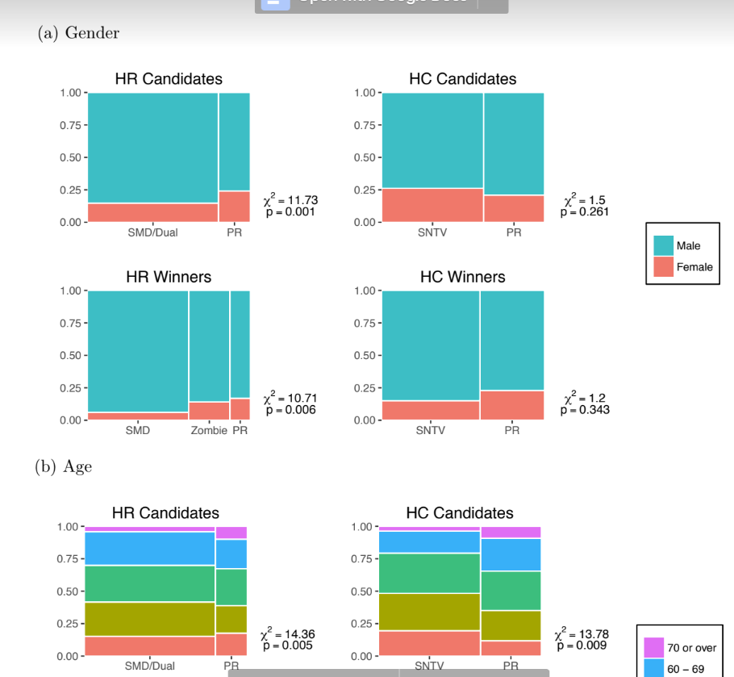

```{r setup, include=FALSE}
knitr::opts_chunk$set(echo = TRUE)

# Load necessary libraries

library(tidyverse)
library(utils)
library(ggmosaic)
library(ggplot2)
library(cregg)
library(tinytex)
library(bookdown)
library(gt)
library(gtsummary)
library(corrplot)

# Decompress the file (Commented out because already completed once)
# untar(tarfile = "ReplicationPackage (1).tar.gz")

# Read in .csv files as dataframes

DD_lo <- read_csv("actual-lower-2014-allcandidates.csv")
DD_up <- read_csv("actual-upper-2013-allcandidates.csv")

# Create bibliography files, commented out because already did so

# knitr::write_bib("knitr", "japan.bib", width = 60)
# knitr::write_bib("knitr", "conjoint-method.bib", width = 60)

```


## Replication Paper Overview: *Identifying voter preferences for politicians’ personal attributes: a conjoint experiment in Japan*

**Introduction**:

  In Yusaku Horiuchi, Teppei Yamamoto and Daniel Smith's (2020) paper, they explore which voter preferences for politicians' characteristics impact their decision on who to vote for, and the magnitude of this effect. While it is commonly established that the personal attributes of political candidates do have an impact on voter choice, as they portray in their literature review, they also highlight the fact that certain traits may have more salience than others (@R-yamamoto). They conducted conjoint analyses involving Average Marginal Component Effects (AMCEs) and Average Component Interaction Effects (ACIEs) to determine the effect of different variables on candidate selection likelihood, and whether said variables interacted with each othe in which ways.
  
  **Literature Review**:
  
  They were also interested in the complexities introduced by the interaction between desired personal attributes and characteristics of election systems. For example, Rule and Zimmerman (1994) found that proportional representation (PR) systems tended to do better in terms of gender parity than first-pass-the-post systems (@gender). Additionally, systems that emphasize voting for a candidate as opposed to voting for a party lend more salience to candidates’ personal attributes, giving their attributes’ desirability (or lack thereof) more weight in the eyes of the voter (@R-salience). As such, Horiuchi et al. (2020) wanted to tease out this relationship: Did Japanese voters really prefer male candidates over female candidates at the baseline, or was this preference influenced by characteristics of the system?

Japan is a useful case study because of its high “intra-country variation” in electoral systems (@electoral). Horiuchi *et al.* (2020) tested for whether knowledge of said electoral systems would impact voter preferences using a randomly assigned experiment, and found that there were significant and consistent indications of voter preferences even without priming with knowledge of electoral systems (@R-yamamoto). They conducted a conjoint survey, in which different candidate attributes were completely randomized and presented for a participant to choose the candidate of their choice. This method of conjoint experiments as applied to political science was popularized by Hainmueller *et al.* (@R-conjointmethod). Another method employed in the replication paper was compared observational data of actual politicians to the conjoint experiment results. This comparison revealed that the actual representatives in Japan’s parliament are very different from the “ideal” candidates of the participants, demonstrating that other variables that weren’t captured in the conjoint experiment play a large role in elections, such as party candidate recruitment systems (@R-yamamoto).


**Appendix**:
Below, please find a replicated graphic that displays the difference in average treatment effects of certain variables based on a politician's gender (*Fig. 1*). *Fig. 2* displays 8 mosaic plots, the likes of which can be found in the Appendix. *Fig. 3* is an image file that is a screenshot of the replication paper's Appendix, for ease of comparison to replicated graphs in *Fig. 2*. *Fig. 4* is a replication of the co-correlation matrix that determines the correlation between two different variables, as many variables such as age, gender, celebrity status, family political ties, occupation, party, education, etc. were examined. All analysis for this paper, while it is still in progress, can be found at the working Github repo.^[Working repository can be found here: https://github.com/caievelyn/milestone]

I would also like to clarify which findings of the paper I was able to replicate. The main findings, which present themselves in the form of the conjoint AMCE charts pictured directly below, were able to be replicated, as well as the mosaic and co-correlation matrices of the paper. Charts not include in this replication are additional mosaic plots, since the original Appendix had many based off of variables other than age and gender.

```{r pre_processing_data, include = FALSE}
### Recoding Variables

## System type indicators

# Create a new column called win_type_1 that encodes the results from the
#DD_lo$result column.

DD_lo <- DD_lo %>%
  mutate(win_type_1 = as.factor(case_when(result == 1 ~ "SMD",
                                result == 2 ~"Zombie",
                                result == 3 ~ "PR",
                                TRUE ~ NA_character_)),
         elec_type_1 = case_when(prcode == 0 ~ "SMD",
                                 kucode == 0 ~ "PR",
                                 TRUE ~ "Both"),
         elec_type_2 = as.factor(case_when(elec_type_1 == "SMD" | elec_type_1 == "Both" ~ "SMD/Dual",
                                 TRUE ~ elec_type_1)))


DD_up <- DD_up %>%
  mutate(win_type_1 = as.factor(districttype),
         elec_type_1 = win_type_1,
         win_type_2 = as.factor(case_when(win_type_1 == "SMD" | win_type_1 == "MMD" ~ "SNTV",
                                win_type_1 == "PR" ~ "PR",
                                TRUE ~ NA_character_)),
         elec_type_2 = win_type_2)

# Recode values

DDD <- list(DD_lo, DD_up)

for(i in 1:length(DDD))
  {DD <- DDD[[i]] %>%
    mutate(win = case_when(result > 0 ~ 1,
                           TRUE ~ 0),
           celeb = as.factor(case_when(celeb == 0 ~ "No",
                                       celeb == 1 ~ "Yes",
                                       TRUE ~ NA_character_)),
           busi_emp = as.factor(case_when(busi_emp == 0 ~ "No",
                                          busi_emp == 1 ~ "Yes",
                                          TRUE ~ NA_character_)),
           busi_exec = as.factor(case_when(busi_exec == 0 ~ "No",
                                           busi_exec == 1 ~ "Yes",
                                           TRUE ~ NA_character_)),
           bcrat = as.factor(case_when(bcrat == 0 ~ "No",
                                       bcrat == 1 ~ "Yes",
                                       TRUE ~ NA_character_)),
           localbcrat = as.factor(case_when(localbcrat == 0 ~ "No",
                                            localbcrat == 1 ~ "Yes",
                                            TRUE ~ NA_character_)),
           pref_assy = as.factor(case_when(pref_assy == 0 ~ "No",
                                           pref_assy == 1 ~ "Yes",
                                           TRUE ~ NA_character_)),
           sec = as.factor(case_when(sec == 0 ~ "No",
                                     sec == 1 ~ "Yes",
                                     TRUE ~ NA_character_)),
           experience_lab = as.character(experience_lab),
           experience_lab = factor(experience_lab, levels = c("Currently in office, 3+ terms", "Currently in office, 2 terms", "Currently in office, 1 term", "Formerly in office, 3+ terms", "Formerly in office, 2 terms", "Formerly in office, 1 term", "No experience")),
           age_lab = as.character(case_when(age < 40 ~ "Under 40",
                                         age >= 40 & age < 60 ~ "50 - 59",
                                         age >= 60 & age < 70 ~ "60 - 69",
                                         age >= 70 ~ "70 or over",
                                         TRUE ~ NA_character_)),
           age_lab = factor(age_lab, levels = c("70 or over", "60 - 69", "50 - 59", "Under 40")),
           educ_lab = as.factor(case_when(educ_lab == "Local public university" ~ "Other public university",
                                          TRUE ~ educ_lab)),
           party_en = factor(party_en, levels = c("LDP", "Komeito", "JCP", "DPJ")),
           home_lab = factor(home_lab, ordered = TRUE),
           dynastic_lab = as_factor(case_when(dynastic_lab == "Local-level elected politician" ~ "Loc. Pol.",
                                              dynastic_lab == "National-level elected politician" ~ "MP",
                                              dynastic_lab == "Cabinet minister" ~ "Cab. Min.",
                                              TRUE ~ "None")))
           DDD[[i]] <- DD
}

# Unlist

DD_lo <- DDD[[1]]
DD_up <- DDD[[2]]

# Reorder Levels

# lower house
DD_lo %>%
  mutate(party_en = factor(party_en, levels = c("Independent","Other","PFG","JIP","LDP","Komeito","DPJ","PLP","SDP","JCP")))

# upper house
DD_up %>%
  mutate(party_en = factor(party_en, levels = c("Independent","Other","JIP","LDP","Komeito","DPJ","PLP","SDP","JCP")))

## Filter for winners

DD_lo_win <- DD_lo %>%
  filter(win == 1)

DD_up_win <- DD_up %>%
  filter(win == 1)
```

```{r conjoint_data, include = FALSE, cache = TRUE}
load("conjoint.RData")

# Rename the volumns with multiple strings for names, which confuses cj()

DD <- DD %>%
  rename("Education" = `Highest Educational Attainment`,
         "Previous_Occupation" = `Prior Occupation`,
         "Parent_Political_Background" = `Parental Political Background`)

DD_cj <- cj(DD,
            formula = Y.1 ~ Party + Age + Experience + Hometown + Education + Previous_Occupation,
            estimate = "amce",
            by = ~Gender)

DD_diff <- cj(DD,
              formula = Y.1 ~ Party + Age + Experience + Hometown + Education + Previous_Occupation,
              estimate = "amce_diff",
              by = ~Gender)

x <- plot(rbind(DD_cj, DD_diff)) +
  ggplot2::facet_wrap(~BY, ncol = 3L) +
  ggplot2::labs(title = "AMCE by Gender",
                caption = "Data from Horiuchi, Smith, & Yamamato via Dataverse") +
  ggthemes::theme_few() +
  ggplot2::theme(legend.position = "right",
                 axis.text = element_text(size=10))
```

```{r display, echo = FALSE, fig.width= 10, fig.height = 8.5, fig.cap = "The first two columns on the left display the average treatment effects for different variables, keeping the gender of the candidate constant. The third column displays the difference in average treatment effect, subtracting that of males to that of females. As you can see, party and age have large effects on candidate selection. However, when taking the different in AMCEs, there is no substantial difference between traits that are desired in male and female candidates. The average treatment effect can be interpreted as the 'boost' a certain characteristic gives a candidate; negative values indicate hurting the candidate's chances of being chosen, while positive values reflect desirable traits."}

# Display the plot

x
```


```{r mosaic, echo = FALSE, fig.height = 3, fig.width = 3}

## gender (Fig A.1.a)
DD_lo$by <- DD_lo$gender_lab
DD_up$by <- DD_up$gender_lab
DD_lo_win$by <- DD_lo_win$gender_lab
DD_up_win$by <- DD_up_win$gender_lab

DD_lo_mosaic <- DD_lo %>%
  select(elec_type_2, by) %>%
  group_by(elec_type_2, by) %>%
  count()

# Mosaic plots by gender
gender_DD_lo <- ggplot(DD_lo) + 
  geom_mosaic(aes(x = product(elec_type_2), fill = by)) +
  theme_classic() +
  labs(title = "HR Candidates") +
  scale_y_continuous(breaks = seq(0, 1, by = 0.25),
                     labels = c("0.00", "0.25", "0.50", "0.75", "1.00")) +
  theme(axis.title.x = element_blank(),
        axis.title.y = element_blank(),
        legend.title = element_blank(),
        legend.box.margin = margin(),
        plot.title = element_text(hjust = 0.5),
        axis.line = element_blank())

gender_DD_up <- ggplot(DD_up) + 
  geom_mosaic(aes(x = product(elec_type_2), fill = by)) +
  theme_classic()+
  labs(title = "HC Candidates") +
  scale_y_continuous(breaks = seq(0, 1, by = 0.25),
                     labels = c("0.00", "0.25", "0.50", "0.75", "1.00")) +
  theme(axis.title.x = element_blank(),
        axis.title.y = element_blank(),
        legend.title = element_blank(),
        legend.box.margin = margin(),
        plot.title = element_text(hjust = 0.5),
        axis.line = element_blank())

gender_DD_lo_win <- ggplot(DD_lo_win) + 
  geom_mosaic(aes(x = product(win_type_1), fill = by)) +
  theme_classic() +
  labs(title = "HR Winners") +
  scale_y_continuous(breaks = seq(0, 1, by = 0.25),
                     labels = c("0.00", "0.25", "0.50", "0.75", "1.00")) +
  theme(axis.title.x = element_blank(),
        axis.title.y = element_blank(),
        legend.title = element_blank(),
        legend.box.margin = margin(),
        plot.title = element_text(hjust = 0.5),
        axis.line = element_blank())

gender_DD_up_win <- ggplot(DD_up_win) + 
  geom_mosaic(aes(x = product(elec_type_2), fill = by)) +
  theme_classic() +
  labs(title = "HC Winners") +
  scale_y_continuous(breaks = seq(0, 1, by = 0.25),
                     labels = c("0.00", "0.25", "0.50", "0.75", "1.00")) +
  theme(axis.title.x = element_blank(),
        axis.title.y = element_blank(),
        legend.title = element_blank(),
        legend.box.margin = margin(),
        plot.title = element_text(hjust = 0.5),
        axis.line = element_blank())

# Display the gender mosaic plots

gender_DD_lo
gender_DD_up
gender_DD_lo_win
gender_DD_up_win


# Mosaic plots by age
age_DD_lo <- ggplot(DD_lo) + 
  geom_mosaic(aes(x = product(elec_type_2), fill = age_lab)) +
  theme_classic() +
  labs(title = "HR Candidates") +
  scale_y_continuous(breaks = seq(0, 1, by = 0.25),
                     labels = c("0.00", "0.25", "0.50", "0.75", "1.00")) +
  theme(axis.title.x = element_blank(),
        axis.title.y = element_blank(),
        legend.title = element_blank(),
        legend.box.margin = margin(),
        plot.title = element_text(hjust = 0.5),
        axis.line = element_blank())

age_DD_up <- DD_up %>%
  mutate(elec_type_2 = factor(elec_type_2, levels = c("SNTV", "PR"))) %>%
  ggplot() + 
  geom_mosaic(aes(x = product(elec_type_2), fill = age_lab)) +
  theme_classic()+
  labs(title = "HC Candidates") +
  scale_y_continuous(breaks = seq(0, 1, by = 0.25),
                     labels = c("0.00", "0.25", "0.50", "0.75", "1.00")) +
  theme(axis.title.x = element_blank(),
        axis.title.y = element_blank(),
        legend.title = element_blank(),
        legend.box.margin = margin(),
        plot.title = element_text(hjust = 0.5),
        axis.line = element_blank())

age_DD_lo_win <- ggplot(DD_lo_win) + 
  geom_mosaic(aes(x = product(win_type_1), fill = age_lab)) +
  theme_classic() +
  labs(title = "HR Winners") +
  scale_y_continuous(breaks = seq(0, 1, by = 0.25),
                     labels = c("0.00", "0.25", "0.50", "0.75", "1.00")) +
  theme(axis.title.x = element_blank(),
        axis.title.y = element_blank(),
        legend.title = element_blank(),
        legend.box.margin = margin(),
        plot.title = element_text(hjust = 0.5),
        axis.line = element_blank())

age_DD_up_win <- DD_up_win %>%
  mutate(elec_type_2 = factor(elec_type_2, levels = c("SNTV", "PR"))) %>%
  ggplot() +
  geom_mosaic(aes(x = product(elec_type_2), fill = age_lab)) +
  theme_classic() +
  labs(title = "HC Winners") +
  scale_y_continuous(breaks = seq(0, 1, by = 0.25),
                     labels = c("0.00", "0.25", "0.50", "0.75", "1.00")) +
  theme(axis.title.x = element_blank(),
        axis.title.y = element_blank(),
        legend.title = element_blank(),
        legend.box.margin = margin(),
        plot.title = element_text(hjust = 0.5),
        axis.line = element_blank())

# Display the age-based mosaic plots

age_DD_lo
age_DD_up
age_DD_lo_win
age_DD_up_win
```


*Figure 2*: The above eight mosaic plots subset by gender and age. HR represents House of Representatives, the lower chamber of Japanese parliament, whereas HC represents the House of Councillors, the upper chamber of Japanese parliament. The figures also compare the share of candidates that ran in SNTV (multi-member)/PR districts versus the proportion of winners from either district.



*Figure 3*: Screenshot from Replication Paper for Comparison of Mosaic Plots


```{r correlation_matrix, echo = FALSE}
# Make correlation matrix (Code mainly unaltered from replication file)

DDD <- list(DD_lo, DD_lo_win, DD_up, DD_up_win)
cormats <- as.list(rep(NA,4))

for(i in 1:length(DDD)){
  DDD[[i]]$experience_bin <- DDD[[i]]$experience > 0
  DDD[[i]]$college <- DDD[[i]]$educ_lab != "High school"
  DDD[[i]]$todai <- DDD[[i]]$educ_lab == "University of Tokyo"
  DDD[[i]]$home_bin <- DDD[[i]]$home_lab == "Born inside district"
  DDD[[i]]$dynastic_bin <- DDD[[i]]$dynastic_lab != "None"
  DDD[[i]]$LDP <- DDD[[i]]$party_en == "LDP"
  DDD[[i]]$DPJ <- DDD[[i]]$party_en == "DPJ"
  DDD[[i]]$JCP <- DDD[[i]]$party_en == "JCP"
  DDD[[i]]$locpol <- DDD[[i]]$pref_assy == "Yes" | DDD[[i]]$pref_gov
  atts <- subset(DDD[[i]], select = c("age", "experience_bin", "female", "college", "todai", "home_bin", "dynastic_bin", "LDP", "DPJ", "JCP", "locpol"))
  names(atts) <- c("Age", "Exp.", "Gender", "Any\n College", "U of\n Tokyo", "Local", "Dynastic", "LDP", "DPJ", "JCP", "Loc. Pol.\n Exp.")
  cormats[[i]] <- cor(atts, use="pairwise")
}

titles <- c("HR Candidates", "HR Winners", "HC Candidates", "HC Winners")

for(i in 1:length(cormats)){
  cormats[[i]][4:5,4:5] <- NA
  cormats[[i]][8:10,8:10] <- NA
}

par(mfrow = c(1,2))
for(i in c(2,4)){
  suppressWarnings(corrplot(cormats[[i]], method = "color", type = "lower", tl.pos = "ld", cl.pos = "n", tl.col = "black", addCoef.col = "black",
                            diag = FALSE, title = titles[i], mar = c(0.02,0.02,02,0.02), na.label = " ", line = -1, tl.cex = 0.7, number.cex = 0.6))
}

```

*Figure 4*: Co-correlation matrix providing the correlation coefficients between two variables. Negative values are shaded in red and positive values are shaded in blue. The intensity of the color corresponds to the magnitude of the correation coefficient.

## Extension of the Paper:

This class will require us to provide some sort of academic extension in our replication of the paper. If you browse through the text of the article, or the lengthy Appendix, you will find that Horiuchi, Smith, and Yamamoto were very thorough in evaluating ACIEs (average component interaction effects) and AMCEs (average marginal component effects) of different variables. Evaluating the ACIEs of gender revealed that male polticians get a significantly greater boost from previous political experience than female candidates, which could explain some of the gap between the conjoint survey data and actual observations. They also checked the conjoint data against the actual data of real elected politicians and drew conclusions from the similarities and differences expressed in terms of preferred candidate attributes. Additionally, there were controls for knowledge priming in their conjoint experiment. A control group had no sort of priming about Japan’s electoral systems, whereas a treatment group was primed with knowledge about Japan’s electoral systems (such as the relationship between voting for a party and proportional representation). They found that there was only one of 56 statistically significant differences in attribute preferences. However, interestingly enough, the actual observations of elected candidates do reveal that there is a discrepancy in the type of candidate elected when constituents are aware of how electoral systems function versus when they are unaware.

As such, I want to focus my extension on this “gap” between the experimental results and real world observations. Because the actual observed data is not in conjoint form, I want to use the tools we’ve been learning in class thus far to construct some sort of regression model contingent upon certain characteristics of the election. For example, for candidates in the Aichi district in 2013, what is the average treatment effect of being male? Of having political experience? Or the interaction between both? I want to explore whether fitting a linear regression model is appropriate or not. Once a model is fitted, I want to plot (maybe using examples from RAOS, which has a lot of different graphs that I have no idea how to make) the results in an aesthetically pleasing way. It was good practice working with conjoint AMCE plots, mosaic plots and correlation matrices as all of these forms of graphics I have not worked with before. However, I’ve barely scratched the surface with all of the aesthetic and computational capabilities of these types of graphics and the packages they’re associated with. If I find nothing meaningful in regression (which I doubt) or if the models turn out to be unstable or inappropriate (much more likely), then I would like to build on perhaps a conjoint plot and plot various differences or interaction effects. Currently, there are differences plotted for the lower and upper houses’ different tiers and for male v. female politicians. I can also look at dynastic politicians (those whose family has a political background) v. non-dynastic politicians, highly educated vs high-school educated candidates, young v. old candidates (although I’d need to define ‘young’ and ‘old’), and dive into other smaller variables such as military service and religion to see what those effects are.
 


## Bibliography
